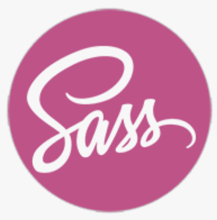
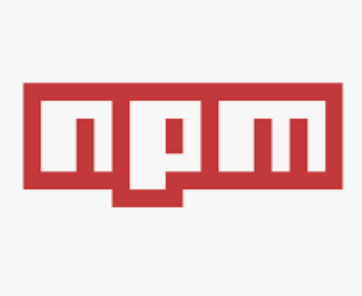

### About me

- 👋🏽  Hi, I’m Sandra Fernández. I was born in Barcelona but I live now with my family in Munich.
- 💎  I’m interested in programming, design, philosophy, architecture and art.
- 💬  Fluent in Spanish, English, German, French and Catalan. I have studied in Japan (Jyochi University) and have some basic knowledge of Russian and Sanskrit (which by the way is the coolest language ever, in my humble opinion)
- 🌎  Living abroad for +25 years, I have developped cross-cultural skills and feel comfortable working in international, multicultural        environements.
- 👀  I am currently looking to join a company and build a career as a front-end developer.
- 📫  Feel free to contact me: sandraenmunich@gmail.com 
 
 
### I work with

                      

### Fun Facts

I am a natural born yogini. Get to know me better at my Yoga web page: www.sandrafernandezyoga.com

<!---
SandraFernandz/SandraFernandz is a ✨ special ✨ repository because its `README.md` (this file) appears on your GitHub profile.
You can click the Preview link to take a look at your changes.
--->
