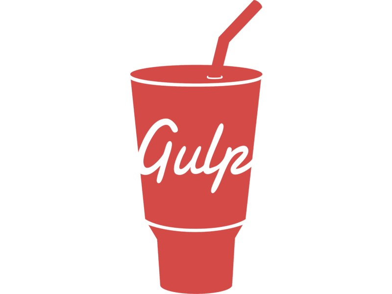
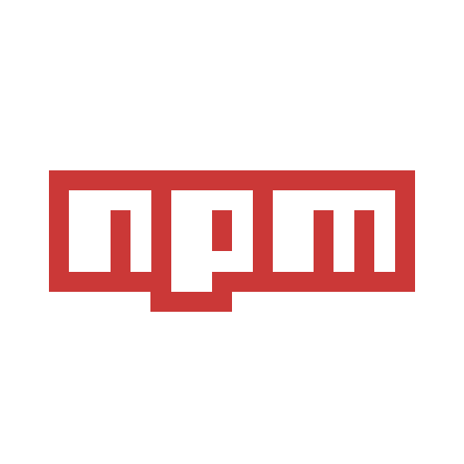

### About me

- 👋🏽  Hi, I’m Sandra Fernández. I was born in Barcelona but I live now with my family in Munich.
- 💎  I’m interested in programming, design, philosophy, architecture and art.
- 💬  Fluent in Spanish, English, German, French and Catalan. I have studied in Japan (Jyochi University) and have some basic knowledge of Russian and Sanskrit.
- 🌎  Living abroad for +25 years, I have developped cross-cultural skills and feel comfortable working in international, multicultural        environements.
- 👀  I am currently working as a front-end developer for CHECK24.
- 📫  Feel free to contact me: sandraenmunich@gmail.com 
 
 
### I work with

                      

### Fun Facts

I worked for +10 years as a yoga teacher instructor as well as yoga and meditation teacher. I am passionate about philosophy (Kashmir Shaivism). I built the first yoga Spanish speaking community in Munich.

<!---
SandraFernandz/SandraFernandz is a ✨ special ✨ repository because its `README.md` (this file) appears on your GitHub profile.
You can click the Preview link to take a look at your changes.
--->
